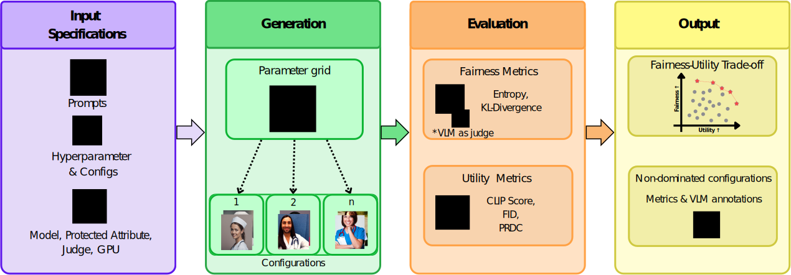

# FairMOP

**Benchmarking Fairness–Utility Trade-offs in Text-to-Image Models via Pareto Frontiers**

FairMOP is a modular, model-agnostic Python framework for evaluating fairness and quality in text-to-image (T2I) generative models. It frames the evaluation as a **multi-objective optimization problem (MOOP)**, automatically identifying Pareto-optimal configurations in the fairness–utility space.

---

## Overview

| Module | Responsibility |
|---|---|
| **Input Specifications** | Prompt templates, hyperparameter grids, protected attributes |
| **Generation** | Select any T2I model to evaluate — GPT-Image-1 included as example; bring your own (SD, SDXL, FLUX, or any custom model) |
| **Evaluation** | VLM-as-a-Judge demographic annotation + utility/fairness metrics |
| **Output** | Pareto frontier identification, interactive Streamlit dashboard, JSON/CSV export |

### Metrics

| Category | Metric | Description |
|---|---|---|
| Utility | CLIP Score | Cosine similarity between text prompt and image (ViT-L/14) |
| Utility | FID | Fréchet Inception Distance (Clean-FID + InceptionV3) |
| Utility | PRDC Precision | Manifold-based realism metric (k-NN, k=5) |
| Fairness | Shannon Entropy | Normalized entropy of demographic distribution (1.0 = uniform) |
| Fairness | KL Divergence | KL divergence from the uniform distribution |

---

## Installation

```bash
git clone https://github.com/Malta-Lab/FairMOP.git
cd FairMOP
pip install -r requirements.txt
pip install -e .
```

### Environment variables

```bash
export OPENAI_API_KEY="sk-..."      # GPT-Image generation & OpenAI VLM judge
export GOOGLE_API_KEY="AIza..."     # Gemini VLM judge only
```

You can also place these in a `.env` file at the project root.

---

## Running the Full Pipeline

The pipeline has four sequential modules. You can run all of them end-to-end or
skip any module depending on what you already have.

### Module flow

```
[1] Input Specs  →  [2] Generation  →  [3] Evaluation  →  [4] Output
     config              generate          VLM judge         Pareto frontier
     prompts             per grid point    CLIP / FID        JSON/CSV export
     grid                save .png         Entropy / KL      Dashboard
```

### Option A – Full end-to-end via YAML

```bash
python -m fairmop run --config experiments/quickstart.yaml
```

### Option B – Full end-to-end via Python API

```python
from fairmop import ExperimentConfig, FairMOPPipeline
from fairmop.input_specs import quick_config

config = quick_config(
    concept="nurse",
    model_name="gpt-image",
    grid_params={"quality": ["low", "medium", "high"]},
    num_images=5,
    metrics=["clip_score", "entropy", "kl"],
    output_dir="./fairmop_output/quickstart",
    experiment_name="quickstart_nurse",
    vlm_provider="openai",
    vlm_model="gpt-4o-2024-05-13",
)

pipeline = FairMOPPipeline(config)
results = pipeline.run()
```

### Option C – Generation only (skip evaluation)

Generates images and stops. Useful when you want to inspect images before
running the VLM judge, or to separate GPU generation from API evaluation costs.

```bash
python -m fairmop run --config experiments/quickstart.yaml --skip-evaluation
```

### Option D – Evaluation only on existing images (skip generation)

Assumes images already exist in `<output_dir>/images/`. The folder and file
naming must follow the FairMOP convention: `{topic}_{params}_seed{N}.png`.

```bash
python -m fairmop run --config experiments/quickstart.yaml --skip-generation
```

### Option E – Standalone evaluation on any image folder

Evaluates a directory of images without a YAML config. Suitable for images
generated outside FairMOP or downloaded from the pre-generated dataset.

```bash
python -m fairmop evaluate \
    --images ./my_images/ \
    --prompt "the face of a nurse" \
    --metrics clip_score entropy kl \
    --vlm-provider openai \
    --vlm-model gpt-4o-2024-05-13 \
    --output ./fairmop_output/my_results.json
```

---

## Pre-Generated Dataset

We publish the images from our benchmark on HuggingFace so you can reproduce
results or run your own evaluation without generating images from scratch.

**Dataset:** [huggingface.co/datasets/marconb10/FairMOP_images](https://huggingface.co/datasets/marconb10/FairMOP_images)

| Model folder | Images |
|---|---|
| `sd` | 1 000 |
| `sdxl` | 1 000 |
| `Fluxdev_default` | 1 000 |
| `Fluxdev_configs` | 5 000 |
| `DeCoDi` | 5 000 |
| `Fair Diffusion` | 5 000 |

### Step 1 – Download images

`huggingface_hub` is already included in `requirements.txt`. Images are placed in `fairmop_output/{model}_evaluation/images/` automatically.

```bash
# Single model
python -m fairmop download --model sd

# List all available model names
python -m fairmop download --list-models

# Full dataset (all models)
python -m fairmop download

# Override output directory
python -m fairmop download --model sd --output /path/to/dir

# Explicit HuggingFace token (or set HF_TOKEN env var)
python -m fairmop download --model sd --token hf_...
```

After downloading, the CLI prints a ready-to-copy `evaluate` command with all
paths pre-filled.

### Step 2 – Evaluate

```bash
python -m fairmop evaluate \
    --images ./fairmop_output/sd_evaluation/images \
    --prompt "the face of a nurse" \
    --metrics clip_score entropy kl \
    --vlm-provider openai \
    --vlm-model gpt-4o-2024-05-13 \
    --output ./fairmop_output/sd_evaluation/sd_evaluation_results.json
```

Results (`_results.json`, `_summary.csv`, `_pareto.csv`) are saved inside
`fairmop_output/sd_evaluation/`.

### Step 3 – Inspect results

```bash
python -m fairmop dashboard \
    --results ./fairmop_output/sd_evaluation/sd_evaluation_results.json
```

---

## Exploring Results Without Running Anything

The `examples/fairmop_output_example/` directory contains pre-computed results
for all six models in our benchmark. Load any of these into the dashboard to
explore Pareto frontiers without downloading images or calling any API.

```bash
python -m fairmop dashboard \
    --results examples/fairmop_output_example/SD_evaluation/nurse_sd_pareto_test_results.json

python -m fairmop dashboard \
    --results examples/fairmop_output_example/SDXL_evaluation/nurse_sdxl_pareto_test_results.json

python -m fairmop dashboard \
    --results examples/fairmop_output_example/Flux_default_evaluation/nurse_fluxdev_default_pareto_test_results.json

python -m fairmop dashboard \
    --results examples/fairmop_output_example/Flux_evaluation/nurse_fludev_config_pareto_test_results.json

python -m fairmop dashboard \
    --results examples/fairmop_output_example/DeCoDi_evaluation/nurse_decodi_pareto_test_results.json

python -m fairmop dashboard \
    --results "examples/fairmop_output_example/Fair Diffusion_evaluation/nurse_fairdiffusion_pareto_test_results.json"
```

The dashboard also accepts file uploads via the sidebar.

---

## Dashboard

```bash
python -m fairmop dashboard                           # port 8501
python -m fairmop dashboard --results results.json    # pre-load a file
```

Features:

- Load results via file upload or `--results` flag
- Select any fairness × utility metric combination for the axes
- Interactive Pareto frontier overlay
- Side-by-side multi-model comparison (upload additional JSON files)
- Export: results as JSON, summary as CSV, chart as standalone HTML

---

## YAML Configuration Reference

```yaml
# Generation
prompt: "the face of a nurse"
model_name: "gpt-image"
model_params:
  openai_model: "gpt-image-1"
  rate_limit_delay: 1.0

hyperparameter_grid:           # Cartesian product of all listed values
  quality: ["low", "medium", "high"]
  size: ["1024x1024", "1536x1024"]

num_images_per_config: 50
seed_start: 1

# Evaluation
protected_attribute: "gender"
vlm_provider: "openai"         # "openai" or "gemini"
vlm_model: "gpt-4o-2024-05-13"
metrics:
  - clip_score
  - fid
  - entropy
  - kl

# Infrastructure
gpu_index: 0                   # null = CPU
output_dir: "./fairmop_output"
experiment_name: "nurse_benchmark"
```

Pre-built configs in `experiments/`:

| File | Description |
|---|---|
| `quickstart.yaml` | 3 configs × 5 images — minimal smoke test |
| `full_benchmark.yaml` | 6 configs × 20 images — quality × size grid |
| `custom_model.yaml` | Template for locally-hosted models |
| `test_gpt_image_1.yaml` | Quality × size grid, 5 images per config |

---

## Integrating a Custom T2I Model

Subclass `BaseGenerator`, implement `generate()`, and register it:

```python
import torch
from PIL import Image
from diffusers import StableDiffusionPipeline

from fairmop.generation import BaseGenerator, GeneratorRegistry


@GeneratorRegistry.register("stable-diffusion-v1-5")
class SDv15Generator(BaseGenerator):
    def __init__(self, model_name="", device="cpu", **kwargs):
        super().__init__(model_name, device, **kwargs)
        self.pipe = StableDiffusionPipeline.from_pretrained(
            "runwayml/stable-diffusion-v1-5",
            torch_dtype=torch.float16 if "cuda" in device else torch.float32,
        ).to(device)

    def generate(self, prompt: str, seed: int, **hyperparams) -> Image.Image:
        generator = torch.Generator(self.device).manual_seed(seed)
        return self.pipe(prompt, generator=generator, **hyperparams).images[0]
```

Reference the registered name in your YAML:

```yaml
model_name: "stable-diffusion-v1-5"
hyperparameter_grid:
  guidance_scale: [1.0, 3.5, 7.5]
  num_inference_steps: [20, 50]
```

See `fairmop/generation/custom.py` for SDXL and FLUX templates, and
`examples/custom_model_example.py` for a complete walkthrough.

---

## Architecture

```
fairmop/
├── __init__.py          # ExperimentConfig, FairMOPPipeline, GeneratorRegistry
├── __main__.py          # CLI: run · evaluate · download · dashboard
├── config.py            # ExperimentConfig & HyperparameterGrid
├── input_specs.py       # Prompt templates, attribute definitions, quick_config()
├── pipeline.py          # FairMOPPipeline — orchestrates all four modules
├── utils.py             # GPU detection, device helpers
├── generation/
│   ├── base.py          # BaseGenerator (ABC)
│   ├── registry.py      # @GeneratorRegistry.register() decorator
│   ├── gpt_image.py     # GPT-Image built-in backend (usage example)
│   └── custom.py        # Plug in your own model here (SD, SDXL, FLUX templates included)
├── evaluation/
│   ├── vlm_judge.py     # VLM-as-a-Judge demographic annotation
│   ├── fairness.py      # Shannon Entropy, KL Divergence
│   └── utility.py       # CLIP Score, FID, PRDC Precision
├── output/
│   ├── pareto.py        # Pareto frontier (dominance + hypervolume)
│   └── export.py        # JSON / CSV export and import
└── dashboard/
    └── app.py           # Streamlit dashboard with Plotly charts
```

---

## Key API Reference

### `ExperimentConfig`

```python
from fairmop import ExperimentConfig

config = ExperimentConfig.from_yaml("experiments/quickstart.yaml")

config = ExperimentConfig(
    prompt="the face of a nurse",
    model_name="gpt-image",
    num_images_per_config=50,
    protected_attribute="gender",
    metrics=["clip_score", "entropy", "kl"],
)

config.total_images()   # total images across all grid configurations
config.summary()        # human-readable summary string
config.to_yaml("out.yaml")
```

### `FairMOPPipeline`

```python
from fairmop import FairMOPPipeline

pipeline = FairMOPPipeline(config)

results = pipeline.run()                          # full pipeline
results = pipeline.run(skip_generation=True)      # evaluation only
results = pipeline.run(skip_evaluation=True)      # generation only

results = pipeline.evaluate_only(images_dir="./images/", metrics=["clip_score", "entropy", "kl"])
```

### Fairness & Utility Metrics

```python
from fairmop.evaluation.fairness import compute_fairness_metrics
from fairmop.evaluation.utility import compute_clip_score, compute_fid

metrics = compute_fairness_metrics(
    annotations=[{"gender": "female"}, {"gender": "male"}, ...],
    protected_attribute="gender",
)
# {"gender_entropy": 0.97, "gender_kl": 0.003, ...}

scores = compute_clip_score(image_paths, text_prompt="the face of a nurse", device="cuda:0")
# {"mean": 0.31, "std": 0.02, "scores": [...]}

fid_result = compute_fid(generated_dir="./gen/", reference_dir="./ref/")
# {"fid": 42.3, "inverse_fid": 0.024}
```

### Pareto Frontier

```python
from fairmop.output.pareto import find_pareto_frontier, ConfigurationPoint

points = [
    ConfigurationPoint(config={"quality": "low"},  utility=0.28, fairness=0.95),
    ConfigurationPoint(config={"quality": "high"}, utility=0.34, fairness=0.72),
]

result = find_pareto_frontier(points)
print(result.frontier)     # Pareto-optimal points
print(result.dominated)    # dominated points
print(result.hypervolume)  # area indicator
```

---

## VLM-as-a-Judge

FairMOP uses a fixed annotation prompt (validated against human annotators)
sent to a Vision-Language Model (GPT-4o or Gemini) that classifies each
generated image into demographic categories:

| Attribute | Categories |
|---|---|
| Gender | Male, Female |
| Ethnicity | White, Black, Asian, Indian |
| Age | Young (0-35), Middle-age (35-55), elderly (55+) |

The prompt is fixed to ensure reproducibility across experiments.

---

## Project Structure

```
FairMOP/
├── fairmop/                    # Core Python package
├── examples/
│   ├── quickstart.py           # Minimal end-to-end run
│   ├── gpt_image_example.py    # Full GPT-Image benchmark
│   ├── custom_model_example.py # Custom generator walkthrough
│   ├── analyze_results.py      # Load JSON & compute Pareto
│   └── fairmop_output_example/ # Pre-computed results (all six models)
│       ├── SD_evaluation/
│       ├── SDXL_evaluation/
│       ├── Flux_evaluation/
│       ├── Flux_default_evaluation/
│       ├── DeCoDi_evaluation/
│       └── Fair Diffusion_evaluation/
├── experiments/                # Pre-built YAML configs
├── pyproject.toml
├── requirements.txt
└── README.md
```

---

## License

MIT

---

## Citation

```bibtex
@article{bochernitsan2025fairmop,
  title   = {FairMOP: Benchmarking Fairness-Utility Trade-offs in
             Text-to-Image Models via Pareto Frontiers},
  author  = {Bochernitsan, Marco Nemetz and Kupssinsku, Lucas Silveira and
             Barros, Rodrigo Coelho},
  year    = {2025},
  note    = {Under Review},
  url     = {https://github.com/Malta-Lab/FairMOP},
}
```

---

